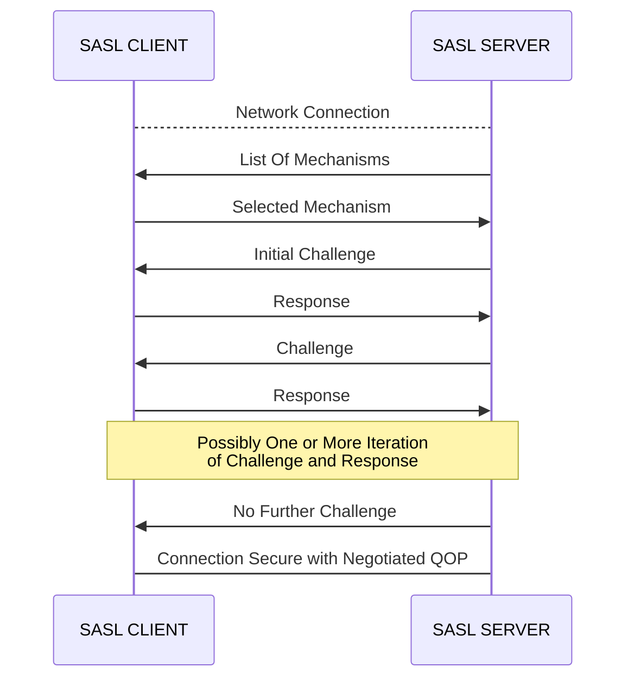

# 引子
常见的大数据开源项目(Hadoop, ZooKeeper, Kafka) 在实现认证时都不约而同地选择了同一个框架 -- SASL. 我对这块内容一直处于一知半解的状态, 感觉有必要梳理一下.

# SASL 是什么
SASL(Simple Authentication and Security Layer) 是一个认证和数据加密协议的框架. 作用是将应用层协议(如 SMTP, LDAP)与具体的 SASL Mechanism (如DIGEST-MD5, GSSAPI)解耦.

# SASL 如何工作

可以进行多轮 Challenge-Response, 直到完成认证并协商好 QOP(Quality of Protection).

> 注意: SASL 框架并没有规定 Challenge-Response 中使用的数据结构和数据的交换方式. 这些都需要在具体的 SASL Mechanism 中实现.

# Java 对 SASL 的支持

Java 提供了一套 API, 帮助应用实现客户端和服务端之间的认证. 应用可以通过这套 API 调用不同的 SASL Mechanism.

## SaslServer & SaslClient
Java 包`javax.security.sasl`下面的 `SaslServer`  和 `SaslClient`  是 Java SASL API 的核心 interface.

创建 `SaslServer`  的模版代码
```java
SaslServer ss = Sasl.createSaslServer(
  mechanism, 
  protocol, 
  serverName, 
  props, 
  callbackHandler);
```

参数:
- mechanism - IANA 组织规定的 SASL Mechanism, 如 DIGEST-MD5, GSSAPI.
- protocol - 应用协议名称, 如 hdfs, zookeeper.
- serverName - 服务器域名
- props - 认证相关配置
- callbackHandler - 用于向 `javax.security.auth.callback.Callback` 注入认证相关的额外信息, 如服务端存储的用户密码.

创建 `SaslClient`  的模版代码
```java
SaslClient sc = Sasl.createSaslClient(
  mechanisms, 
  authorizationId, 
  protocol, 
  serverName, 
  props,
  callbackHandler);
```

参数:
- mechanisms - SASL Mechanism 列表
- authorizationId - 客户端身份标识
- callbackHandler - 用于向 `javax.security.auth.callback.Callback` 注入认证相关的额外信息, 如用户名&密码.

## SASL Security Provider
SASL Mechanism 的具体实现由 SASL Security Provider 提供, 通过 [Java Cryptography Architecture](https://docs.oracle.com/javase/9/security/java-cryptography-architecture-jca-reference-guide.htm) (JCA) 注册.

Java 默认的 SASL Security Provider 是 SunSASL, 支持 DIGEST-MD5, GSSAPI, NTLM 等 SASL Mechanism.

Java 支持自定义 SASL Security Provider. Provider 内需要实现 `SaslClient`  和 `SaslServer`  两个接口类.

## JAAS
SASL Mechanism 的各种实现, 只能完成客户端和服务端之间认证凭据的交换和通信的加密. 客户端如何获得认证凭据, 服务端如何校验客户端的认证凭据, 需要其他框架支持. 

JAAS(Java Authentication and Authorization Service) 正是这样一个框架. 

开发者一般会组合使用 SASL 和 JAAS, 实现完整的客户端和服务端之间的认证流程.

JAAS 的核心概念有以下几个:
- Subject: 代表一个单一实体 (如人或服务) 的安全相关信息的集合，包括关联的身份 (Principal) 和凭据 (Credentials).
- LoginModule: 各种认证方式 (DIGEST, LDAP, UNIX, KERBEROS) 必须实现的 interface.
- Configuration: JAAS 框架配置集
- LoginContext: 根据 Configuration 的配置, 初始化 Subject, 使用配置指定的 LoginModule 完成客户端侧的认证流程.


# 举例: ZooKeeper 的 SASL 认证流程

## 第一步: 加载 JAAS 配置文件
ZooKeeper 的客户端和服务端默认都通过 `javax.security.auth.login.Configuration#getConfiguration` 加载 JAAS 配置. 该方法读取的是 Java System Property `java.security.auth.login.config` 指定的文件. 

客户端和服务端的配置文件内一般包含如下内容.

客户端配置文件
```
Client {
       org.apache.zookeeper.server.auth.DigestLoginModule required
       username="bob"
       password="bobsecret";
};
```
服务端配置文件
```
Server {
       org.apache.zookeeper.server.auth.DigestLoginModule required
       user_super="adminsecret"
       user_bob="bobsecret";
};
```

- `Client` 和 `Server` 分别对应 ZooKeeper 的配置项 `zookeeper.sasl.clientconfig` (默认值 `Client`) 和 `zookeeper.sasl.serverconfig` (默认值 `Server`).

- `org.apache.zookeeper.server.auth.DigestLoginModule` 是 ZooKeeper 实现的 LoginModule.  LoginContext 会使用它完成 JAAS 认证.

- `required` 叫做 ControlFlag, 有 4 个值:
  - REQUIRED：表示这个 LoginModule 必须成功执行认证，如果失败，则整个认证过程失败。但是，即使这个 LoginModule 认证失败，认证过程还会继续尝试其他的 LoginModule 。
  - REQUISITE：表示这个 LoginModule 必须成功执行认证。如果这个 LoginModule 认证失败，则整个认证过程立即失败，不会继续尝试其他的 LoginModule 。
  - SUFFICIENT：表示这个 LoginModule 不必成功执行认证，但如果它成功，认证过程将立即成功结束，不再继续尝试其他的 LoginModule 。如果这个 LoginModule 失败，认证过程将继续尝试其他的 LoginModule 。
  - OPTIONAL：表示这个 LoginModule 不必成功执行认证，无论成功与否，认证过程都会继续尝试其他的 LoginModule 。

- 在客户端, `DigestLoginModule` 会将配置文件中的 `username` 和 `password` 写入 Subject.

- 在服务端, `DigestLoginModule` 不会读取配置文件中的 `user_super` 和 `user_bob`. 我们稍后会说明这两个配置的作用.

## 第二步: 交换认证凭据

交换认证凭据就进入了 SASL 框架的范畴. 

JAAS LoginModule 和 SASL Mechanism 存在配套关系. 与 `DigestLoginModule` 配套的是 DIGEST-MD5. 相应的 SASL Client 和 SASL Server 分别是 `com.sun.security.sasl.digest.DigestMD5Client` 和 `com.sun.security.sasl.digest.DigestMD5Server`.

SASL Client 和 SASL Server Challenge-Response 的过程这里不做深入分析. 

## 第三步: 服务端校验认证凭据
JDK 中的 `DigestMD5Server` 已经实现了校验认证凭据的流程. 核心代码都在`DigestMD5Server#validateClientResponse` 中.

可以简单概括为以下几步:
1. 从客户端的 responseVal 中提取 username
2. 从客户端的 responseVal 中提取经过 MD5 加密的 password, 记作 md5FromClient
3. 构造 `NameCallback` 和 `PasswordCallback`, 通过 `CallbackHandler` 获取 Server 侧与 username 对应的 password.
```
NameCallback ncb = new NameCallback("DIGEST-MD5 authentication ID: ", username);
PasswordCallback pcb = new PasswordCallback("DIGEST-MD5 password: ", false);
cbh.handle(new Callback[] {rcb, ncb, pcb});
```
4. 使用 MD5 加密 Server 侧的 password, 记作 md5FromServer
5. 若 md5FromClient == md5FromServer, 校验通过; 否则, 校验不通过.

ZooKeeper 实现了 `org.apache.zookeeper.server.auth.SaslServerCallbackHandler`, 从 JAAS 配置文件找到 username 对应的 password,
并放入 `PasswordCallback`.

## 第四步: 建立加密连接

客户端和服务端通过以上步骤, 同步了 username, password 等多个变量. 

使用 MD5 将这些变量组合加密后, 获得一对密钥 <clientKey, serverKey>.

Client 使用 clientKey 加密, serverKey 解密. Server 使用 serverKey 加密, clientKey 解密.

